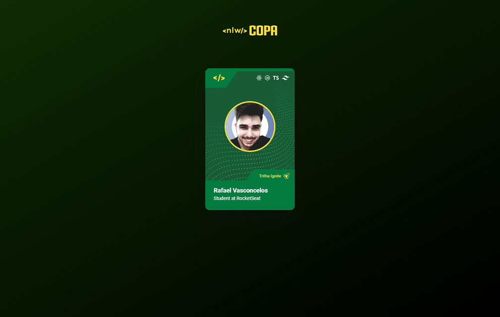

<h1 align="center"> NLW Cup Card </h1>

 Deploy Link - https://rafacelos.github.io/NLW-Cup-Card/

 User interaction design for choosing the teaching track at the NLW event.

  <a href="#-technologies">Technologies</a>&nbsp;&nbsp;&nbsp;|&nbsp;&nbsp;&nbsp;
  <a href="#-project">Project</a>&nbsp;&nbsp;&nbsp;|&nbsp;&nbsp;&nbsp;
  <a href="#-layout">Layout</a>&nbsp;&nbsp;&nbsp;|&nbsp;&nbsp;&nbsp;
  <a href="#memo-license">License</a>

  

 

  

## 🚀 Technologies

This project was developed with the following technologies:

- HTML and CSS
- JavaScript
- Figma

## 💻 Project

 The project shows a card with the user's photo and the technologies that will be studied. The informations change according to the track chosen (explorer for beginners / ignite for advanced). To change tracks, just press on the card.

## 🔖 Layout

You can view the project layout through [THIS LINK](https://www.figma.com/file/mlWIwGGBVlSJOU31T6p4SZ/NLW-Copa-Card-(Copy)?node-id=0%3A1). You must have a [Figma](https://figma.com) account to access it.

## :memo: License

This project is under the MIT license.

---

Created with ♥ by Rocketseat and Rafacelos :wave: [Join our Community!](https://discord.gg/rocketseat)
